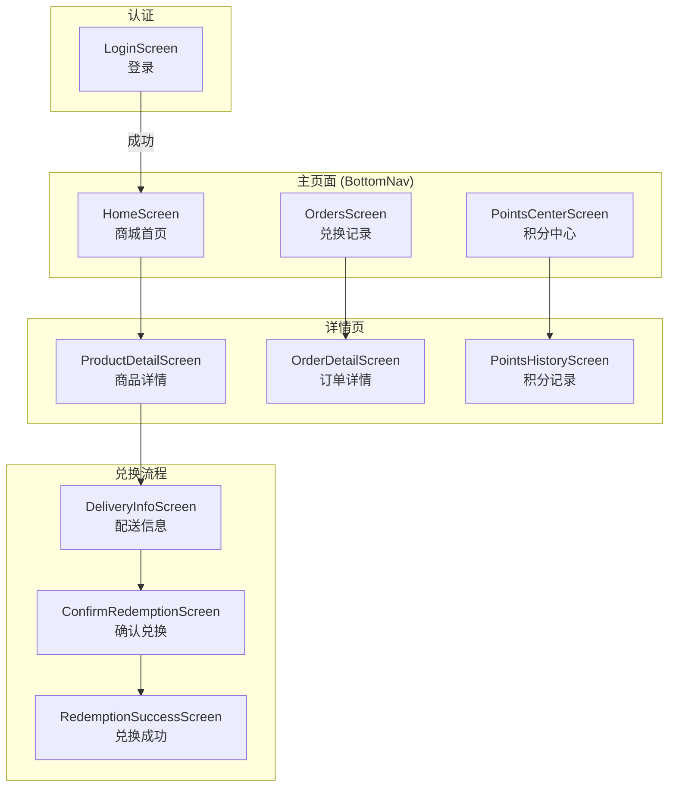
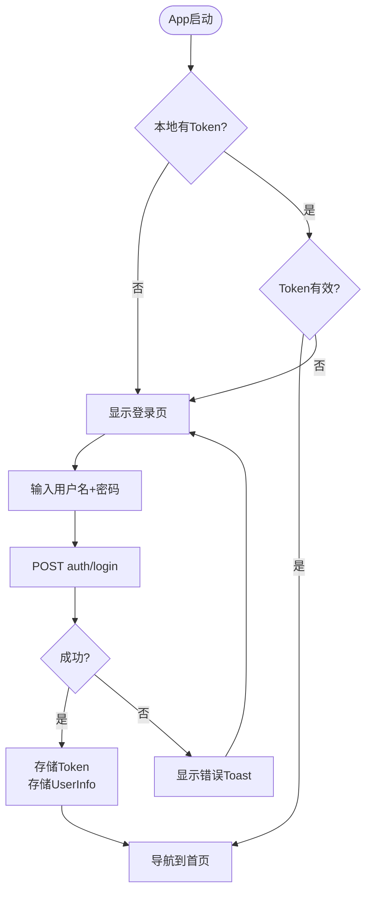
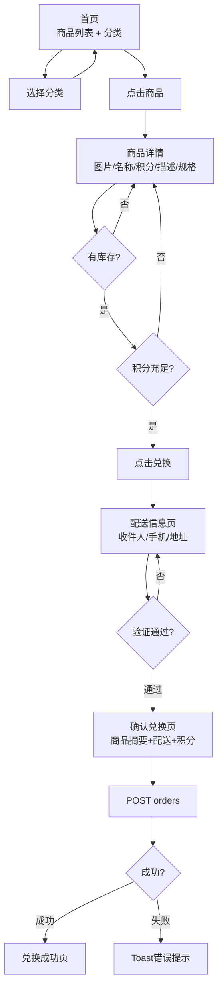

# Android App — 业务逻辑模型

## 页面导航结构



---

## 核心业务流程

### 1. 登录流程



### 2. 商品浏览与兑换流程



---

## 屏幕组件设计

| Screen | 主要组件 | API调用 |
|--------|---------|---------|
| LoginScreen | TextField(username), TextField(password), Button(login) | POST auth/login |
| HomeScreen | CategoryChips, LazyColumn(ProductCard), PullRefresh | GET products, GET categories |
| ProductDetailScreen | AsyncImage, Text(details), SpecChips, RedeemButton | GET products/{id} |
| DeliveryInfoScreen | TextField(name), TextField(phone), TextField(address) | 无 (本地state) |
| ConfirmRedemptionScreen | ProductSummary, DeliveryInfo, PointsCost, ConfirmBtn | POST orders |
| RedemptionSuccessScreen | SuccessIcon, OrderNo, ProductInfo | 无 (路由参数) |
| OrdersScreen | LazyColumn(OrderCard), StatusFilter | GET orders |
| OrderDetailScreen | OrderInfo, StatusTimeline, DeliveryInfo | GET orders/{id} |
| PointsCenterScreen | BalanceCard, StatsRow | GET points/balance |
| PointsHistoryScreen | LazyColumn(TransactionItem), TypeFilter | GET points/transactions |

---

## API 对接改造

### ApiService.kt 需要调整的接口路径

| 当前路径 | 调整后路径 | 说明 |
|---------|-----------|------|
| `auth/login` | `/api/v1/public/auth/login` | 补全完整路径 |
| `user/profile` | `/api/v1/user/profile` | 补全前缀 |
| `products` | `/api/v1/public/product/list` | POST改为GET或调整 |
| `products/{id}` | `/api/v1/public/product/{id}` | 补全前缀 |
| `orders` (POST) | `/api/v1/order/create` | 调整路径 |
| `orders` (GET) | `/api/v1/order/list` | 调整为POST分页 |
| `orders/{id}` | `/api/v1/order/{id}` | 补全前缀 |
| `points/transactions` | `/api/v1/points/transactions` | 补全前缀 |

### 认证Token管理
```kotlin
// OkHttp Interceptor 自动附加 Bearer Token
class AuthInterceptor @Inject constructor(
    private val tokenStore: TokenStore
) : Interceptor {
    override fun intercept(chain: Chain): Response {
        val token = tokenStore.getToken()
        val request = if (token != null) {
            chain.request().newBuilder()
                .addHeader("Authorization", "Bearer $token")
                .build()
        } else chain.request()
        
        val response = chain.proceed(request)
        if (response.code == 401) {
            tokenStore.clear()
            // 触发跳转登录页
        }
        return response
    }
}
```

### 响应包装处理
```kotlin
// 统一处理后端 Result<T> 响应格式
data class ApiResult<T>(
    val code: Int,
    val message: String,
    val data: T?
)

// Repository 层统一解包
suspend fun <T> safeApiCall(call: suspend () -> ApiResult<T>): Result<T> {
    return try {
        val response = call()
        if (response.code == 0 && response.data != null) {
            Result.success(response.data)
        } else {
            Result.failure(ApiException(response.code, response.message))
        }
    } catch (e: Exception) {
        Result.failure(e)
    }
}
```

---

## 数据模型调整

### Product (对齐后端)
```kotlin
@Serializable
data class Product(
    val id: Long,
    val name: String,
    val sku: String,
    val category: String,
    val brand: String? = null,
    val pointsPrice: Int,
    val marketPrice: Double? = null,
    val stock: Int,
    val soldCount: Int,
    val status: Int,
    val description: String? = null,
    val imageUrl: String? = null,
    val subtitle: String? = null,
    val deliveryMethod: String? = null,
    val serviceGuarantee: String? = null,
    val promotion: String? = null,
    val colors: String? = null,
    val specs: List<SpecItem>? = null,
)

@Serializable
data class SpecItem(val key: String, val value: String)
```

### Order (对齐后端)
```kotlin
@Serializable
data class Order(
    val id: Long,
    val orderNo: String,
    val productId: Long,
    val productName: String,
    val pointsAmount: Int,
    val quantity: Int,
    val status: String, // pending/confirmed/shipping/completed/cancelled
    val recipientName: String,
    val recipientPhone: String,
    val recipientAddress: String,
    val createdAt: String,
)
```

### User (对齐后端)
```kotlin
@Serializable
data class User(
    val id: Long,
    val username: String,
    val displayName: String,
    val email: String? = null,
    val role: String,
    val avatarUrl: String? = null,
)
```

### PointsBalance (新增)
```kotlin
@Serializable
data class PointsBalance(
    val balance: Int,
    val totalEarned: Int,
    val totalSpent: Int,
)
```

### PointsTransaction (对齐后端)
```kotlin
@Serializable
data class PointsTransaction(
    val id: Long,
    val type: String, // earn/spend/refund/admin_add/admin_deduct
    val points: Int,
    val balanceAfter: Int,
    val description: String? = null,
    val createdAt: String,
)
```

### CreateOrderRequest (对齐后端)
```kotlin
@Serializable
data class CreateOrderRequest(
    val productId: Long,
    val recipientName: String,
    val recipientPhone: String,
    val recipientAddress: String,
)
```

---

## 本地存储

| Key | 类型 | 用途 |
|-----|------|------|
| auth_token | String | JWT Token |
| user_info | JSON | 用户基本信息 (UserInfo) |

### TokenStore
```kotlin
@Singleton
class TokenStore @Inject constructor(
    @ApplicationContext private val context: Context
) {
    private val prefs = context.getSharedPreferences("auth", Context.MODE_PRIVATE)
    
    fun getToken(): String? = prefs.getString("auth_token", null)
    fun saveToken(token: String) = prefs.edit().putString("auth_token", token).apply()
    fun clear() = prefs.edit().clear().apply()
}
```
