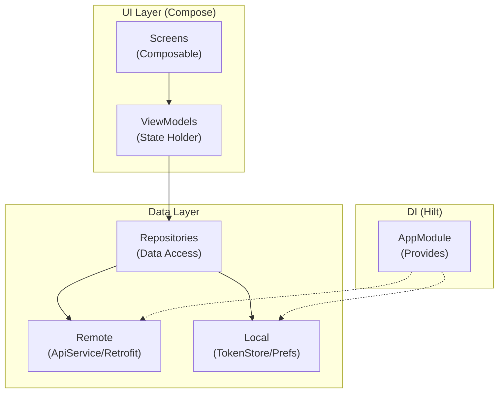

# Android App — 数据模型与架构

## 架构层次



---

## ViewModel 设计

### LoginViewModel
```kotlin
@HiltViewModel
class LoginViewModel @Inject constructor(
    private val authRepository: AuthRepository
) : ViewModel() {
    
    data class UiState(
        val isLoading: Boolean = false,
        val error: String? = null,
        val loginSuccess: Boolean = false,
    )
    
    val uiState: StateFlow<UiState>
    
    fun login(username: String, password: String)
}
```

### HomeViewModel
```kotlin
@HiltViewModel
class HomeViewModel @Inject constructor(
    private val shopRepository: ShopRepository
) : ViewModel() {
    
    data class UiState(
        val products: List<Product> = emptyList(),
        val categories: List<Category> = emptyList(),
        val selectedCategory: String? = null,
        val isLoading: Boolean = false,
        val error: String? = null,
    )
    
    val uiState: StateFlow<UiState>
    
    fun loadProducts(category: String? = null)
    fun selectCategory(category: String?)
    fun refresh()
}
```

### ProductDetailViewModel
```kotlin
@HiltViewModel
class ProductDetailViewModel @Inject constructor(
    private val shopRepository: ShopRepository,
    savedStateHandle: SavedStateHandle
) : ViewModel() {
    
    private val productId: Long = savedStateHandle["productId"]!!
    
    data class UiState(
        val product: Product? = null,
        val isLoading: Boolean = false,
        val error: String? = null,
    )
    
    val uiState: StateFlow<UiState>
    
    fun loadProduct()
}
```

### RedemptionViewModel
```kotlin
@HiltViewModel
class RedemptionViewModel @Inject constructor(
    private val shopRepository: ShopRepository
) : ViewModel() {
    
    data class UiState(
        val isSubmitting: Boolean = false,
        val orderResult: Order? = null,
        val error: String? = null,
    )
    
    val uiState: StateFlow<UiState>
    
    fun createOrder(productId: Long, recipientName: String, 
                    recipientPhone: String, recipientAddress: String)
}
```

### OrdersViewModel
```kotlin
@HiltViewModel
class OrdersViewModel @Inject constructor(
    private val shopRepository: ShopRepository
) : ViewModel() {
    
    data class UiState(
        val orders: List<Order> = emptyList(),
        val selectedStatus: String? = null,
        val isLoading: Boolean = false,
        val error: String? = null,
    )
    
    val uiState: StateFlow<UiState>
    
    fun loadOrders(status: String? = null)
    fun selectStatus(status: String?)
}
```

### PointsViewModel
```kotlin
@HiltViewModel
class PointsViewModel @Inject constructor(
    private val shopRepository: ShopRepository
) : ViewModel() {
    
    data class UiState(
        val balance: PointsBalance? = null,
        val transactions: List<PointsTransaction> = emptyList(),
        val selectedType: String? = null,
        val isLoading: Boolean = false,
        val error: String? = null,
    )
    
    val uiState: StateFlow<UiState>
    
    fun loadBalance()
    fun loadTransactions(type: String? = null)
}
```

---

## Repository 层改造

### AuthRepository (改造)
```kotlin
@Singleton
class AuthRepository @Inject constructor(
    private val apiService: ApiService,
    private val tokenStore: TokenStore,
) {
    suspend fun login(username: String, password: String): Result<User> = runCatching {
        val response = apiService.login(LoginRequest(username, password))
        tokenStore.saveToken(response.data.token)
        response.data.user
    }
    
    fun isLoggedIn(): Boolean = tokenStore.getToken() != null
    
    fun logout() {
        tokenStore.clear()
    }
    
    suspend fun getProfile(): Result<User> = safeApiCall {
        apiService.getProfile()
    }
}
```

### ShopRepository (改造)
```kotlin
@Singleton
class ShopRepository @Inject constructor(
    private val apiService: ApiService,
) {
    suspend fun getProducts(category: String? = null, page: Int = 1): Result<PageResult<Product>>
    suspend fun getProductDetail(id: Long): Result<Product>
    suspend fun getCategories(): Result<List<Category>>
    suspend fun createOrder(request: CreateOrderRequest): Result<Order>
    suspend fun getOrders(status: String? = null, page: Int = 1): Result<PageResult<Order>>
    suspend fun getOrderDetail(id: Long): Result<Order>
    suspend fun getPointsBalance(): Result<PointsBalance>
    suspend fun getPointsTransactions(type: String? = null, page: Int = 1): Result<PageResult<PointsTransaction>>
}
```

---

## ApiService 接口 (改造后)

```kotlin
interface ApiService {

    @POST("api/v1/public/auth/login")
    suspend fun login(@Body request: LoginRequest): ApiResult<LoginResponse>

    @GET("api/v1/user/profile")
    suspend fun getProfile(): ApiResult<User>

    @POST("api/v1/public/product/list")
    suspend fun getProducts(@Body request: ListProductRequest): ApiResult<PageResult<Product>>

    @GET("api/v1/public/product/{id}")
    suspend fun getProductDetail(@Path("id") id: Long): ApiResult<Product>

    @GET("api/v1/public/category/list")
    suspend fun getCategories(): ApiResult<List<Category>>

    @POST("api/v1/order/create")
    suspend fun createOrder(@Body request: CreateOrderRequest): ApiResult<Order>

    @POST("api/v1/order/list")
    suspend fun getOrders(@Body request: ListOrderRequest): ApiResult<PageResult<Order>>

    @GET("api/v1/order/{id}")
    suspend fun getOrderDetail(@Path("id") id: Long): ApiResult<Order>

    @GET("api/v1/points/balance")
    suspend fun getPointsBalance(): ApiResult<PointsBalance>

    @GET("api/v1/points/transactions")
    suspend fun getPointsTransactions(
        @Query("type") type: String? = null,
        @Query("page") page: Int = 1,
        @Query("size") size: Int = 20,
    ): ApiResult<PageResult<PointsTransaction>>
}
```

---

## 导航路由改造

### Routes.kt
```kotlin
object Routes {
    const val LOGIN = "login"
    const val HOME = "home"
    const val PRODUCT_DETAIL = "product/{productId}"
    const val DELIVERY_INFO = "delivery/{productId}"
    const val CONFIRM_REDEMPTION = "confirm_redemption"
    const val REDEMPTION_SUCCESS = "redemption_success/{orderNo}"
    const val ORDERS = "orders"
    const val ORDER_DETAIL = "order/{orderId}"
    const val POINTS_CENTER = "points"
    const val POINTS_HISTORY = "points/history"
}
```

---

## 文件变更清单

### 需要修改的文件
| 文件路径 | 变更内容 |
|---------|---------|
| `data/remote/ApiService.kt` | 重写接口路径，对齐后端API |
| `data/repository/ShopRepository.kt` | 改造方法签名，支持分页和真实响应格式 |
| `data/repository/AuthRepository.kt` | 添加Token管理 |
| `data/model/*.kt` | 调整数据模型对齐后端字段 |
| `di/AppModule.kt` | 添加 AuthInterceptor, TokenStore |
| `ui/navigation/AppNavGraph.kt` | 更新导航路由 |

### 需要新增的文件
| 文件路径 | 用途 |
|---------|------|
| `data/remote/AuthInterceptor.kt` | Token 自动附加拦截器 |
| `data/local/TokenStore.kt` | Token 本地存储 |
| `data/model/ApiResult.kt` | 统一响应包装 |
| `data/model/PageResult.kt` | 分页结果 |
| `data/model/Category.kt` | 分类模型 |
| `data/model/PointsBalance.kt` | 积分余额模型 |
| `data/model/CreateOrderRequest.kt` | 创建订单请求 |
| `ui/viewmodel/LoginViewModel.kt` | 登录 ViewModel |
| `ui/viewmodel/HomeViewModel.kt` | 首页 ViewModel |
| `ui/viewmodel/ProductDetailViewModel.kt` | 详情 ViewModel |
| `ui/viewmodel/RedemptionViewModel.kt` | 兑换 ViewModel |
| `ui/viewmodel/OrdersViewModel.kt` | 订单 ViewModel |
| `ui/viewmodel/PointsViewModel.kt` | 积分 ViewModel |
